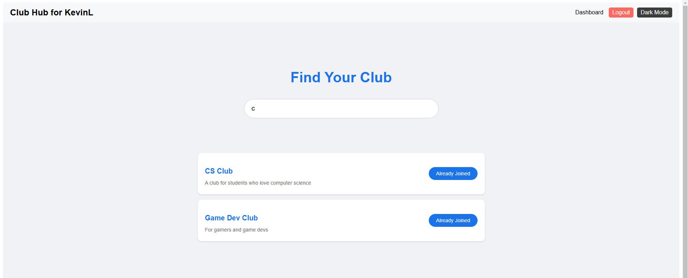

# Club Hub: A Comprehensive Platform for University Club Management

<p align="center">
  
</p>

**Club Hub** is a web-based university club management service designed to enhance experiences among members of various clubs. The application aims to provide a platform for planning club events, managing memberships, facilitating discussions through forums, and fostering community engagement.

## Table of Contents

- [Features](#features)
- [Prerequisites](#prerequisites)
- [**Installation**](#installation)
- [Contributions](#contributions)
- [Documentation](#documentation)
- [Snapshots](#snapshots)
- [Languages and Tools](#languages-and-tools)

## Features

- **User authentication and authorization:** Users can sign up, log in, and log out
- **Create club:** Each user can create a single club
- **Search for clubs:** Search for clubs and join based on keywords
- **Threads discussion:** Each club can create threads and nested-reply to threads
- **Make announcements:** Each club can create social posts as announcements
- **Manage events:** Each club can create events and members can register/unregister for events
- **Chatting:** Each club can create chatrooms and send messages to club members. Chatrooms are live and can be accessed by any club members.

## Prerequisites

- Node.js (v12.0.0 or higher)

Download: https://nodejs.org/en/download/package-manager

- npm (v10.1.0)

```
npm install npm@latest -g
```

- **Option 1 (preferred)**: MySQL server running on your local system and any preferred GUI (e.g. MySQL Workbench)

  - .env file with the following variables:

    - DB_HOST (e.g. localhost)
    - DB_USER (e.g. root)
    - DB_PASSWORD (e.g. password)
    - DB_NAME (e.g. clubhub)
    - You can run the code in clubhub_create_db.sql file to create the database and tables on your local system

- Option 2 (optional): We also host our database server online, in which case you can use the following variables (we used freemysqlhosting.net):
  - DB_HOST= sql3.freemysqlhosting.net
  - DB_USER= sql3749296
  - DB_PASSWORD= ZXRZuYlU94
  - DB_NAME= sql3749296

## Installation

To get started with Club Hub, follow these steps:

1. Clone the repository

   ```
   git clone https://github.com/Daoranger/Club-Hub.git
   ```

2. cd into Club-Hub directory

   ```
   cd Club-Hub
   ```

3. Launch your local MySQL server (preferred MySQL Workbench). Copy-paste and execute the code in **clubhub_create_db.sql file (path: Club-Hub/backend/mysql/clubhub_create_db.sql)** to create the database and tables on your local system.
<p align="center">
  
</p>

4. To run Club Hub on your local system, open two terminals and run the following commands:

   On the first terminal, navigate to the backend directory and run the following command:

   ```
   cd backend
   ```

   Once you are in the backend directory, create a .env file with the variables in prerequisites section (we prefer the variables in **Option 1**). Then run the following command:

   ```
   npm install
   npm start
   ```

   Your backend should be running now. you should get two message that said

   ```
   "Connected to backend!"
   "DB Connection is good!"
   ```

   On the second terminal, navigate to the client directory and run the following command:

   ```
   cd client
   npm install
   npm start
   ```

   After running the command, your browser should automatically open the Club Hub application. You should see home page of Club Hub. If not, open your browser and navigate to http://localhost:3000.

   If it is your first time running the application, you will need to sign up for an account. Then log in with your account credentials.

   Once you login, explore and have fun!

## Contributers

- **Shervan Shahparnia:**
  
- **Hoang Nguyen:**

- **Nathan Durrant:**

- **Aaron Sam:**

- **Nathan Cohn:**

## Documentation

- [Project Proposal](documents/pdfs/Club_Hub-Proposal.pdf)
- [Project EER Diagram](documents/pdfs/Club_Hub-EER_Diagram.pdf)
- [Project Meeting Minutes](documents/pdfs/Club_Hub-Meeting_Minutes.pdf)
- [Project Presentation](documents/pdfs/Club_Hub-Final_Presentation_Slides.pdf)
- [Project Final Report](documents/pdfs/Club_Hub-Final_Project_Report.pdf)

## Snapshots

### Web Homepage


### Signup


### Login


### Initial User Dashboard


### User Dashboard


### Search Club



### Club Homepage


### Chatroom


### Club Events


### Club Post


### Club Threads


### Create Thread


### Individual Thread Page


## Languages and Tools

<p align="left">
  <!-- Frontend -->
  <a href="https://www.w3.org/html/" target="_blank" rel="noreferrer">
    
  </a>
  <a href="https://www.w3schools.com/css/" target="_blank" rel="noreferrer">
    
  </a>
  <a href="https://developer.mozilla.org/en-US/docs/Web/JavaScript" target="_blank" rel="noreferrer">
    
  </a>
  <a href="https://reactjs.org/" target="_blank" rel="noreferrer">
    
  </a>
  
  <!-- Backend -->
  <a href="https://nodejs.org" target="_blank" rel="noreferrer">
    
  </a>
  <a href="https://expressjs.com" target="_blank" rel="noreferrer">
    
  </a>
  
  <!-- Database -->
  <a href="https://www.mysql.com/" target="_blank" rel="noreferrer">
    
  </a>
  
  <!-- Software Tools -->
  <a href="https://git-scm.com/" target="_blank" rel="noreferrer">
    
  </a>
  <a href="https://postman.com" target="_blank" rel="noreferrer">
    
  </a>
</p>
